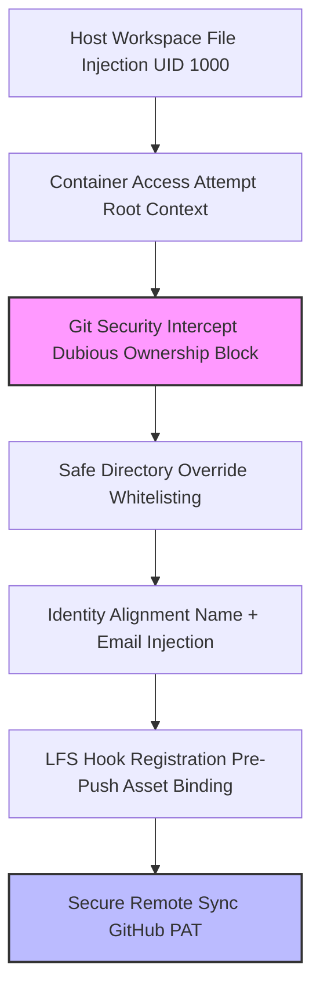

# 🧠 CODESPACES ARCH LINUX ENV

### Automated Containerized Development Environment Setup

[](https://github.com)
[](https://archlinux.org)
[](https://github.com)

`codespaces-arch` is a comprehensive engineering guide and workflow blueprint for initializing, troubleshooting, and running a micro-minimal Arch Linux development environment directly inside GitHub Codespaces.

Designed for **systems engineers and kernel developers**, it handles containerized package bootstrapping, filesystem security boundaries, and multi-user Git identity hooks.

---

## 🔷 Overview

This environment workflow runs a **lightweight Arch userspace container**, optimized for:

* ⚡ Rapid package deployment (`pacman`)
* 🛠️ Native host compilation (`base-devel`, `cmake`)
* 🔐 Secure repository access (UID mapping control)
* 🖨️ Clean text pipelines (`less` pager alignment)

---

## ⚡ Features

* ✅ Unified system dependency bootstrapping
* ✅ Git Large File Storage (LFS) pre-push pipeline setup
* ✅ Cross-UID container security mapping (Dubious Ownership fixes)
* ✅ Automated environment identity binding
* ✅ Native terminal paging correction
* ✅ Matrix comparison for Debian-to-Arch adaptation

---

## 📦 Installation

### Requirements

* GitHub Codespaces instance
* Base image with root/sudo capabilities

### Build & Initialize Environment

```bash
# Step 1: Force system synchronization and full upgrade
sudo pacman -Syu --noconfirm

# Step 2: Provision toolchains and core utilities
sudo pacman -S --noconfirm base-devel git neovim less git-lfs cmake ninja perf

# Step 3: Global initialization of Git LFS hooks
git lfs install
```

---

## 🧑‍💻 Configuration

### Basic Syntax
```bash
git config --global [OPTION] [VALUE]
```

### Environment Diagnostics


| Error Pattern | Root Cause | Target Resolution |
| :--- | :--- | :--- |
| `fatal: detected dubious ownership` | Host UID (1000) vs Container Root | Register safe directory configuration |
| `fatal: author identity unknown` | Missing local profile hooks | Inject global user name and email |
| `cannot run less: No such file` | Native package absence | Provision `less` utility via pacman |

### Configuration Flags

#### 🔹 Git Identity Tuning

| Option | Description | Target Value |
| :--- | :--- | :--- |
| `user.name` | Developer name | `Rofik` |
| `user.email` | Primary notification email | `alirofikr@gmail.com` |

#### 🔹 Security Boundaries

| Option | Description | Target Value |
| :--- | :--- | :--- |
| `safe.directory` | Whitelists shared workspace root | `/workspaces/SecureCleaner-Kernel` |

---

## 🧠 Processing Pipeline



---

## 🧪 Deployment Workflows

### 1. Environment Onboarding
```bash
sudo pacman -Syu --noconfirm && sudo pacman -S --noconfirm base-devel git neovim less git-lfs cmake ninja perf && git lfs install
```

### 2. Bypass Filesystem Ownership Security Block
```bash
git config --global --add safe.directory /workspaces/SecureCleaner-Kernel
```

### 3. Local User Registration
```bash
git config --global user.name "Rofik"
git config --global user.email "alirofikr@gmail.com"
```

### 4. Asset Upload Sequence
```bash
git add .
git commit -m "chore: migrate runtime environment to arch linux userspace"
git push
```

---

## 🚀 Architecture

### Core Components
* **Containerized Userspace**
  * Runs Arch components inside Docker
  * Shares underlying host system kernel
  * Bypasses native systemd service layers
* **Git Security Model**
  * Strict boundary policy checks on UIDs
  * Prevents unauthorized context execution
* **Dependency Chain**
  * Decoupled toolchains (`cmake`/`ninja`)
  * Unified via Arch package databases

---

## ⚡ Command Mapping


| Action | Debian/Ubuntu Command | Arch Linux Command |
| :--- | :--- | :--- |
| **Sync Repositories** | `apt update` | ❌ *(Do not use partial syncs)* |
| **Upgrade System** | `apt upgrade` | `pacman -Syu` |
| **Install Utilities** | `apt install [pkg]` | `pacman -S [pkg]` |

---

## 📝 Best Practices

* ⚠️ **Always** run `pacman -Syu` instead of partial syncs (`pacman -Sy`).
* 🔑 Use a **Personal Access Token (PAT)** or SSH key for remote auth instead of passwords.
* 📌 Bind global configs specifically inside the **root user scope** if using container root.

---

## 🔮 Roadmap

* [ ] Automate pipeline via `.devcontainer.json`
* [ ] Abstract root access to custom non-root accounts
* [ ] Build a custom Pacman local mirror cache

---

## 🛠️ Reference Files

### `.devcontainer/devcontainer.json`
```json
{
    "name": "Arch Linux · uv · Lakhimpur",
    "image": "archlinux:latest",
    "postCreateCommand": "bash .devcontainer/setup.sh",
    "forwardPorts": [
        8000,
        3000,
        5432,
        6379
    ],
    "portsAttributes": {
        "8000": {
            "label": "FastAPI",
            "onAutoForward": "silent"
        },
        "3000": {
            "label": "NuxtJS",
            "onAutoForward": "openPreview"
        },
        "5432": {
            "label": "PostgreSQL",
            "onAutoForward": "ignore"
        },
        "6379": {
            "label": "Redis",
            "onAutoForward": "ignore"
        }
    },
    "remoteUser": "root",
    "customizations": {
        "vscode": {
            "extensions": [
                "ms-python.python",
                "ms-python.vscode-pylance",
                "charliermarsh.ruff",
                "Vue.volar",
                "dbaeumer.vscode-eslint",
                "ms-vscode.makefile-tools",
                "tamasfe.even-better-toml"
            ],
            "settings": {
                "editor.formatOnSave": true,
                "[python]": {
                    "editor.defaultFormatter": "charliermarsh.ruff"
                },
                "python.defaultInterpreterPath": "${workspaceFolder}/backend/.venv/bin/python"
            }
        }
    }
}
```

---

## 🤝 Contributing

Issues and optimization PRs are welcome.

---

## 📄 License

This project is licensed under the MIT License.
